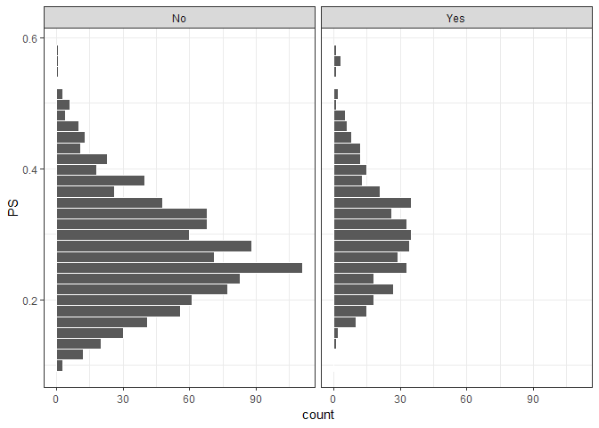
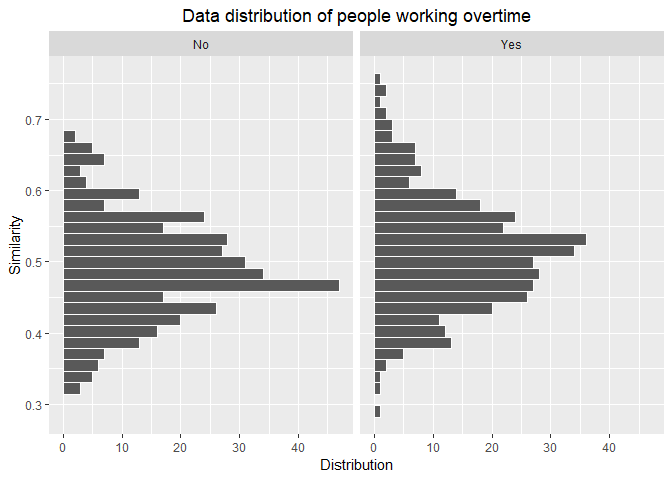

Causal Inference
================

``` r
library(readxl)
library(stargazer)
library(ggplot2)
library(MatchIt)
library(data.table)
library(tableone)
library(rbounds)
library(MESS)
library(dplyr)
```

### Unit of Analysis: Employees

### Treatment: Overtime (Y/N)

### Outcome of Interest: Attrition (Y/N)

> Note: Results of some tests in this markdown may vary by one or two decimal places when re-run as such techniques depend on the 'random value' provided by R interpreter. Always set seed manually to get reproducible results.

Descriptive Stats
-----------------

``` r
hr <- read.csv('WA_Fn-UseC_-HR-Employee-Attrition.csv')
detach()
attach(hr)
str(hr)
```

    ## 'data.frame':    1470 obs. of  35 variables:
    ##  $ ï..Age                  : int  41 49 37 33 27 32 59 30 38 36 ...
    ##  $ Attrition               : Factor w/ 2 levels "No","Yes": 2 1 2 1 1 1 1 1 1 1 ...
    ##  $ BusinessTravel          : Factor w/ 3 levels "Non-Travel","Travel_Frequently",..: 3 2 3 2 3 2 3 3 2 3 ...
    ##  $ DailyRate               : int  1102 279 1373 1392 591 1005 1324 1358 216 1299 ...
    ##  $ Department              : Factor w/ 3 levels "Human Resources",..: 3 2 2 2 2 2 2 2 2 2 ...
    ##  $ DistanceFromHome        : int  1 8 2 3 2 2 3 24 23 27 ...
    ##  $ Education               : int  2 1 2 4 1 2 3 1 3 3 ...
    ##  $ EducationField          : Factor w/ 6 levels "Human Resources",..: 2 2 5 2 4 2 4 2 2 4 ...
    ##  $ EmployeeCount           : int  1 1 1 1 1 1 1 1 1 1 ...
    ##  $ EmployeeNumber          : int  1 2 4 5 7 8 10 11 12 13 ...
    ##  $ EnvironmentSatisfaction : int  2 3 4 4 1 4 3 4 4 3 ...
    ##  $ Gender                  : Factor w/ 2 levels "Female","Male": 1 2 2 1 2 2 1 2 2 2 ...
    ##  $ HourlyRate              : int  94 61 92 56 40 79 81 67 44 94 ...
    ##  $ JobInvolvement          : int  3 2 2 3 3 3 4 3 2 3 ...
    ##  $ JobLevel                : int  2 2 1 1 1 1 1 1 3 2 ...
    ##  $ JobRole                 : Factor w/ 9 levels "Healthcare Representative",..: 8 7 3 7 3 3 3 3 5 1 ...
    ##  $ JobSatisfaction         : int  4 2 3 3 2 4 1 3 3 3 ...
    ##  $ MaritalStatus           : Factor w/ 3 levels "Divorced","Married",..: 3 2 3 2 2 3 2 1 3 2 ...
    ##  $ MonthlyIncome           : int  5993 5130 2090 2909 3468 3068 2670 2693 9526 5237 ...
    ##  $ MonthlyRate             : int  19479 24907 2396 23159 16632 11864 9964 13335 8787 16577 ...
    ##  $ NumCompaniesWorked      : int  8 1 6 1 9 0 4 1 0 6 ...
    ##  $ Over18                  : Factor w/ 1 level "Y": 1 1 1 1 1 1 1 1 1 1 ...
    ##  $ OverTime                : Factor w/ 2 levels "No","Yes": 2 1 2 2 1 1 2 1 1 1 ...
    ##  $ PercentSalaryHike       : int  11 23 15 11 12 13 20 22 21 13 ...
    ##  $ PerformanceRating       : int  3 4 3 3 3 3 4 4 4 3 ...
    ##  $ RelationshipSatisfaction: int  1 4 2 3 4 3 1 2 2 2 ...
    ##  $ StandardHours           : int  80 80 80 80 80 80 80 80 80 80 ...
    ##  $ StockOptionLevel        : int  0 1 0 0 1 0 3 1 0 2 ...
    ##  $ TotalWorkingYears       : int  8 10 7 8 6 8 12 1 10 17 ...
    ##  $ TrainingTimesLastYear   : int  0 3 3 3 3 2 3 2 2 3 ...
    ##  $ WorkLifeBalance         : int  1 3 3 3 3 2 2 3 3 2 ...
    ##  $ YearsAtCompany          : int  6 10 0 8 2 7 1 1 9 7 ...
    ##  $ YearsInCurrentRole      : int  4 7 0 7 2 7 0 0 7 7 ...
    ##  $ YearsSinceLastPromotion : int  0 1 0 3 2 3 0 0 1 7 ...
    ##  $ YearsWithCurrManager    : int  5 7 0 0 2 6 0 0 8 7 ...

Idea
----

Since our data is cross-sectional data, the experimental method used in this case is Matching. The ideal comparison group is selected that matches the treatment group using either a comprehensive baseline survey or time invariant characteristics. The matches are selected on the basis of similarities in observed characteristics.This assumes no selection bias based on unobserved characteristics

Propensity score matching is used to match treated and untreated observations on the estimated probability of being treated (propensity score).

**Steps followed in propensity Score Matching (PSM):**

1.  Need representative and comparable data for both treatment and comparison groups
2.  Used a logit estimator to estimate attrition as a function of observable characteristics
3.  Used predicted values from estimator to generate propensity score for all treatment and comparison group members to evaluate matching

Check power of test
-------------------

To test whether we have enought data to conclude any significant causal relationship, I have performed a statistical test (power test) in R with the sample size of treatment as input. We find that with this data set we can reliably establish a causal relationship if our average treatment effect is at least 15.77%

``` r
power_t_test(n=364,type=c("two.sample"),alternative="one.sided",power=0.8,sig.level=.1)
```

    ## 
    ##      Two-sample t test power calculation 
    ## 
    ##               n = 364
    ##           delta = 0.1574989
    ##              sd = 1
    ##       sig.level = 0.1
    ##           power = 0.8
    ##     alternative = one.sided
    ## 
    ## NOTE: n is number in *each* group

Covariate balance before matching
---------------------------------

Checking covariate balance before matching, the high P values like EnvironmentSatisfaction indicate that covariates are not properly balanced between treatmemnt and control.

``` r
tabUnmatched <- CreateTableOne(vars=c("ï..Age", "BusinessTravel", "DailyRate", "Department", "DistanceFromHome", "Education", "EducationField", "EnvironmentSatisfaction", "Gender", "HourlyRate", "JobInvolvement", "JobLevel", "JobRole", "JobSatisfaction", "MaritalStatus", "MonthlyIncome", "MonthlyRate", "NumCompaniesWorked", "PercentSalaryHike", "PerformanceRating", "RelationshipSatisfaction", "StockOptionLevel", "TotalWorkingYears", "TrainingTimesLastYear", "WorkLifeBalance", "YearsAtCompany", "YearsInCurrentRole", "YearsSinceLastPromotion", "YearsWithCurrManager"), strata="OverTime", test=TRUE,data=hr)
print(tabUnmatched, smd=TRUE)
```

    ##                                       Stratified by OverTime
    ##                                        No                
    ##   n                                        1054          
    ##   ï..Age (mean (SD))                      36.76 (8.98)   
    ##   BusinessTravel (%)                                     
    ##      Non-Travel                             115 (10.9)   
    ##      Travel_Frequently                      191 (18.1)   
    ##      Travel_Rarely                          748 (71.0)   
    ##   DailyRate (mean (SD))                  800.17 (402.19) 
    ##   Department (%)                                         
    ##      Human Resources                         46 ( 4.4)   
    ##      Research & Development                 690 (65.5)   
    ##      Sales                                  318 (30.2)   
    ##   DistanceFromHome (mean (SD))             9.06 (8.15)   
    ##   Education (mean (SD))                    2.93 (1.01)   
    ##   EducationField (%)                                     
    ##      Human Resources                         19 ( 1.8)   
    ##      Life Sciences                          439 (41.7)   
    ##      Marketing                              111 (10.5)   
    ##      Medical                                332 (31.5)   
    ##      Other                                   55 ( 5.2)   
    ##      Technical Degree                        98 ( 9.3)   
    ##   EnvironmentSatisfaction (mean (SD))      2.67 (1.11)   
    ##   Gender = Male (%)                         646 (61.3)   
    ##   HourlyRate (mean (SD))                  65.99 (20.57)  
    ##   JobInvolvement (mean (SD))               2.73 (0.71)   
    ##   JobLevel (mean (SD))                     2.06 (1.11)   
    ##   JobRole (%)                                            
    ##      Healthcare Representative               94 ( 8.9)   
    ##      Human Resources                         39 ( 3.7)   
    ##      Laboratory Technician                  197 (18.7)   
    ##      Manager                                 75 ( 7.1)   
    ##      Manufacturing Director                 106 (10.1)   
    ##      Research Director                       57 ( 5.4)   
    ##      Research Scientist                     195 (18.5)   
    ##      Sales Executive                        232 (22.0)   
    ##      Sales Representative                    59 ( 5.6)   
    ##   JobSatisfaction (mean (SD))              2.71 (1.09)   
    ##   MaritalStatus (%)                                      
    ##      Divorced                               228 (21.6)   
    ##      Married                                487 (46.2)   
    ##      Single                                 339 (32.2)   
    ##   MonthlyIncome (mean (SD))             6484.93 (4722.88)
    ##   MonthlyRate (mean (SD))              14217.30 (7106.66)
    ##   NumCompaniesWorked (mean (SD))           2.73 (2.53)   
    ##   PercentSalaryHike (mean (SD))           15.22 (3.62)   
    ##   PerformanceRating (mean (SD))            3.15 (0.36)   
    ##   RelationshipSatisfaction (mean (SD))     2.68 (1.09)   
    ##   StockOptionLevel (mean (SD))             0.79 (0.84)   
    ##   TotalWorkingYears (mean (SD))           11.22 (7.69)   
    ##   TrainingTimesLastYear (mean (SD))        2.86 (1.33)   
    ##   WorkLifeBalance (mean (SD))              2.77 (0.71)   
    ##   YearsAtCompany (mean (SD))               7.05 (5.98)   
    ##   YearsInCurrentRole (mean (SD))           4.30 (3.62)   
    ##   YearsSinceLastPromotion (mean (SD))      2.21 (3.23)   
    ##   YearsWithCurrManager (mean (SD))         4.22 (3.61)   
    ##                                       Stratified by OverTime
    ##                                        Yes                p      test
    ##   n                                         416                      
    ##   ï..Age (mean (SD))                      37.33 (9.53)     0.282     
    ##   BusinessTravel (%)                                       0.240     
    ##      Non-Travel                              35 ( 8.4)               
    ##      Travel_Frequently                       86 (20.7)               
    ##      Travel_Rarely                          295 (70.9)               
    ##   DailyRate (mean (SD))                  808.35 (407.26)   0.726     
    ##   Department (%)                                           0.954     
    ##      Human Resources                         17 ( 4.1)               
    ##      Research & Development                 271 (65.1)               
    ##      Sales                                  128 (30.8)               
    ##   DistanceFromHome (mean (SD))             9.52 (7.99)     0.328     
    ##   Education (mean (SD))                    2.88 (1.06)     0.436     
    ##   EducationField (%)                                       0.881     
    ##      Human Resources                          8 ( 1.9)               
    ##      Life Sciences                          167 (40.1)               
    ##      Marketing                               48 (11.5)               
    ##      Medical                                132 (31.7)               
    ##      Other                                   27 ( 6.5)               
    ##      Technical Degree                        34 ( 8.2)               
    ##   EnvironmentSatisfaction (mean (SD))      2.84 (1.05)     0.007     
    ##   Gender = Male (%)                         236 (56.7)     0.122     
    ##   HourlyRate (mean (SD))                  65.64 (19.74)    0.766     
    ##   JobInvolvement (mean (SD))               2.73 (0.72)     0.893     
    ##   JobLevel (mean (SD))                     2.06 (1.11)     0.983     
    ##   JobRole (%)                                              0.584     
    ##      Healthcare Representative               37 ( 8.9)               
    ##      Human Resources                         13 ( 3.1)               
    ##      Laboratory Technician                   62 (14.9)               
    ##      Manager                                 27 ( 6.5)               
    ##      Manufacturing Director                  39 ( 9.4)               
    ##      Research Director                       23 ( 5.5)               
    ##      Research Scientist                      97 (23.3)               
    ##      Sales Executive                         94 (22.6)               
    ##      Sales Representative                    24 ( 5.8)               
    ##   JobSatisfaction (mean (SD))              2.77 (1.13)     0.347     
    ##   MaritalStatus (%)                                        0.665     
    ##      Divorced                                99 (23.8)               
    ##      Married                                186 (44.7)               
    ##      Single                                 131 (31.5)               
    ##   MonthlyIncome (mean (SD))             6548.55 (4675.29)  0.816     
    ##   MonthlyRate (mean (SD))              14555.83 (7148.73)  0.412     
    ##   NumCompaniesWorked (mean (SD))           2.61 (2.42)     0.426     
    ##   PercentSalaryHike (mean (SD))           15.18 (3.75)     0.835     
    ##   PerformanceRating (mean (SD))            3.16 (0.36)     0.867     
    ##   RelationshipSatisfaction (mean (SD))     2.80 (1.06)     0.063     
    ##   StockOptionLevel (mean (SD))             0.79 (0.88)     0.986     
    ##   TotalWorkingYears (mean (SD))           11.44 (8.02)     0.625     
    ##   TrainingTimesLastYear (mean (SD))        2.64 (1.17)     0.002     
    ##   WorkLifeBalance (mean (SD))              2.73 (0.69)     0.299     
    ##   YearsAtCompany (mean (SD))               6.89 (6.48)     0.654     
    ##   YearsInCurrentRole (mean (SD))           4.06 (3.62)     0.254     
    ##   YearsSinceLastPromotion (mean (SD))      2.12 (3.20)     0.639     
    ##   YearsWithCurrManager (mean (SD))         3.89 (3.46)     0.111     
    ##                                       Stratified by OverTime
    ##                                        SMD   
    ##   n                                          
    ##   ï..Age (mean (SD))                    0.061
    ##   BusinessTravel (%)                    0.099
    ##      Non-Travel                              
    ##      Travel_Frequently                       
    ##      Travel_Rarely                           
    ##   DailyRate (mean (SD))                 0.020
    ##   Department (%)                        0.018
    ##      Human Resources                         
    ##      Research & Development                  
    ##      Sales                                   
    ##   DistanceFromHome (mean (SD))          0.057
    ##   Education (mean (SD))                 0.045
    ##   EducationField (%)                    0.076
    ##      Human Resources                         
    ##      Life Sciences                           
    ##      Marketing                               
    ##      Medical                                 
    ##      Other                                   
    ##      Technical Degree                        
    ##   EnvironmentSatisfaction (mean (SD))   0.158
    ##   Gender = Male (%)                     0.093
    ##   HourlyRate (mean (SD))                0.017
    ##   JobInvolvement (mean (SD))            0.008
    ##   JobLevel (mean (SD))                  0.001
    ##   JobRole (%)                           0.148
    ##      Healthcare Representative               
    ##      Human Resources                         
    ##      Laboratory Technician                   
    ##      Manager                                 
    ##      Manufacturing Director                  
    ##      Research Director                       
    ##      Research Scientist                      
    ##      Sales Executive                         
    ##      Sales Representative                    
    ##   JobSatisfaction (mean (SD))           0.054
    ##   MaritalStatus (%)                     0.052
    ##      Divorced                                
    ##      Married                                 
    ##      Single                                  
    ##   MonthlyIncome (mean (SD))             0.014
    ##   MonthlyRate (mean (SD))               0.047
    ##   NumCompaniesWorked (mean (SD))        0.047
    ##   PercentSalaryHike (mean (SD))         0.012
    ##   PerformanceRating (mean (SD))         0.010
    ##   RelationshipSatisfaction (mean (SD))  0.108
    ##   StockOptionLevel (mean (SD))          0.001
    ##   TotalWorkingYears (mean (SD))         0.028
    ##   TrainingTimesLastYear (mean (SD))     0.181
    ##   WorkLifeBalance (mean (SD))           0.061
    ##   YearsAtCompany (mean (SD))            0.025
    ##   YearsInCurrentRole (mean (SD))        0.066
    ##   YearsSinceLastPromotion (mean (SD))   0.027
    ##   YearsWithCurrManager (mean (SD))      0.093

Calculate Propensity Score
--------------------------

Calcuate propensity score to evaluate treatment control balance

``` r
hr$PS<-glm( OverTime~+ ï..Age + BusinessTravel + DailyRate + Department + DistanceFromHome + Education + EducationField + EnvironmentSatisfaction + Gender + HourlyRate + JobInvolvement + JobLevel + JobRole + JobSatisfaction + MaritalStatus + MonthlyIncome + MonthlyRate + NumCompaniesWorked  + PercentSalaryHike + PerformanceRating + RelationshipSatisfaction + StockOptionLevel + TotalWorkingYears + TrainingTimesLastYear + WorkLifeBalance + YearsAtCompany + YearsInCurrentRole + YearsSinceLastPromotion + YearsWithCurrManager, data=hr, family = "binomial")$fitted.values
```

Plot propensity distribution before matching
--------------------------------------------

The distribution of data with the propensity scores for treatment and control before matching technique is applied

``` r
hr$attrCode<-ifelse(hr$Attrition == 'Yes', 1, 0)
hr$overcode<-ifelse(hr$OverTime == 'Yes', 1, 0)

ggplot(hr, aes(x = PS)) + 
  geom_histogram(color = "white") + 
  facet_wrap(~OverTime) +theme_bw() + coord_flip()
```

    ## `stat_bin()` using `bins = 30`. Pick better value with `binwidth`.



Applyling Matching technique
----------------------------

``` r
Match <- matchit(overcode~+ ï..Age + BusinessTravel + DailyRate + Department + DistanceFromHome + Education + EducationField  +  EnvironmentSatisfaction + Gender + HourlyRate + JobInvolvement + JobLevel + JobRole + JobSatisfaction + MaritalStatus + MonthlyIncome + MonthlyRate + NumCompaniesWorked +  PercentSalaryHike + PerformanceRating + RelationshipSatisfaction  + StockOptionLevel + TotalWorkingYears + TrainingTimesLastYear + WorkLifeBalance + YearsAtCompany + YearsInCurrentRole + YearsSinceLastPromotion + YearsWithCurrManager, data = hr, method = 'nearest', distance="logit", caliper=0.006,replace=FALSE)

Matched.ids <- data.table(match.data(Match))$EmployeeNumber
hr.Matched <- hr[hr$EmployeeNumber %in% Matched.ids,]
```

Covariate balance after matching
--------------------------------

Checking covariate balance after matching, the low P values indicate that covariates are not balanced between treatmemnt and control.

``` r
tabMatched <- CreateTableOne(vars=c("ï..Age", "BusinessTravel", "DailyRate", "Department", "DistanceFromHome", "Education", "EducationField", "EnvironmentSatisfaction", "Gender", "HourlyRate", "JobInvolvement", "JobLevel", "JobRole", "JobSatisfaction", "MaritalStatus", "MonthlyIncome", "MonthlyRate", "NumCompaniesWorked", "PercentSalaryHike", "PerformanceRating", "RelationshipSatisfaction", "StockOptionLevel", "TotalWorkingYears", "TrainingTimesLastYear", "WorkLifeBalance", "YearsAtCompany", "YearsInCurrentRole", "YearsSinceLastPromotion", "YearsWithCurrManager"), strata="OverTime", test=TRUE,data=hr.Matched)
print(tabMatched, smd=TRUE)
```

    ##                                       Stratified by OverTime
    ##                                        No                
    ##   n                                         362          
    ##   ï..Age (mean (SD))                      36.40 (9.18)   
    ##   BusinessTravel (%)                                     
    ##      Non-Travel                              34 ( 9.4)   
    ##      Travel_Frequently                       67 (18.5)   
    ##      Travel_Rarely                          261 (72.1)   
    ##   DailyRate (mean (SD))                  813.40 (399.24) 
    ##   Department (%)                                         
    ##      Human Resources                         13 ( 3.6)   
    ##      Research & Development                 234 (64.6)   
    ##      Sales                                  115 (31.8)   
    ##   DistanceFromHome (mean (SD))             9.50 (8.23)   
    ##   Education (mean (SD))                    2.86 (1.05)   
    ##   EducationField (%)                                     
    ##      Human Resources                          4 ( 1.1)   
    ##      Life Sciences                          151 (41.7)   
    ##      Marketing                               39 (10.8)   
    ##      Medical                                117 (32.3)   
    ##      Other                                   19 ( 5.2)   
    ##      Technical Degree                        32 ( 8.8)   
    ##   EnvironmentSatisfaction (mean (SD))      2.72 (1.11)   
    ##   Gender = Male (%)                         211 (58.3)   
    ##   HourlyRate (mean (SD))                  65.24 (20.15)  
    ##   JobInvolvement (mean (SD))               2.75 (0.72)   
    ##   JobLevel (mean (SD))                     2.02 (1.12)   
    ##   JobRole (%)                                            
    ##      Healthcare Representative               24 ( 6.6)   
    ##      Human Resources                         12 ( 3.3)   
    ##      Laboratory Technician                   66 (18.2)   
    ##      Manager                                 22 ( 6.1)   
    ##      Manufacturing Director                  34 ( 9.4)   
    ##      Research Director                       19 ( 5.2)   
    ##      Research Scientist                      80 (22.1)   
    ##      Sales Executive                         83 (22.9)   
    ##      Sales Representative                    22 ( 6.1)   
    ##   JobSatisfaction (mean (SD))              2.72 (1.08)   
    ##   MaritalStatus (%)                                      
    ##      Divorced                                74 (20.4)   
    ##      Married                                168 (46.4)   
    ##      Single                                 120 (33.1)   
    ##   MonthlyIncome (mean (SD))             6337.73 (4689.63)
    ##   MonthlyRate (mean (SD))              14185.67 (7209.87)
    ##   NumCompaniesWorked (mean (SD))           2.67 (2.49)   
    ##   PercentSalaryHike (mean (SD))           15.37 (3.81)   
    ##   PerformanceRating (mean (SD))            3.19 (0.39)   
    ##   RelationshipSatisfaction (mean (SD))     2.82 (1.04)   
    ##   StockOptionLevel (mean (SD))             0.76 (0.83)   
    ##   TotalWorkingYears (mean (SD))           10.70 (7.73)   
    ##   TrainingTimesLastYear (mean (SD))        2.68 (1.23)   
    ##   WorkLifeBalance (mean (SD))              2.75 (0.70)   
    ##   YearsAtCompany (mean (SD))               6.69 (6.16)   
    ##   YearsInCurrentRole (mean (SD))           3.98 (3.68)   
    ##   YearsSinceLastPromotion (mean (SD))      2.19 (3.33)   
    ##   YearsWithCurrManager (mean (SD))         3.71 (3.44)   
    ##                                       Stratified by OverTime
    ##                                        Yes                p      test
    ##   n                                         362                      
    ##   ï..Age (mean (SD))                      36.95 (9.57)     0.428     
    ##   BusinessTravel (%)                                       0.893     
    ##      Non-Travel                              33 ( 9.1)               
    ##      Travel_Frequently                       72 (19.9)               
    ##      Travel_Rarely                          257 (71.0)               
    ##   DailyRate (mean (SD))                  803.35 (414.62)   0.740     
    ##   Department (%)                                           0.764     
    ##      Human Resources                         14 ( 3.9)               
    ##      Research & Development                 242 (66.9)               
    ##      Sales                                  106 (29.3)               
    ##   DistanceFromHome (mean (SD))             9.33 (7.85)     0.775     
    ##   Education (mean (SD))                    2.90 (1.07)     0.700     
    ##   EducationField (%)                                       0.982     
    ##      Human Resources                          6 ( 1.7)               
    ##      Life Sciences                          148 (40.9)               
    ##      Marketing                               37 (10.2)               
    ##      Medical                                116 (32.0)               
    ##      Other                                   22 ( 6.1)               
    ##      Technical Degree                        33 ( 9.1)               
    ##   EnvironmentSatisfaction (mean (SD))      2.79 (1.07)     0.357     
    ##   Gender = Male (%)                         214 (59.1)     0.880     
    ##   HourlyRate (mean (SD))                  65.01 (19.64)    0.877     
    ##   JobInvolvement (mean (SD))               2.73 (0.72)     0.643     
    ##   JobLevel (mean (SD))                     2.03 (1.09)     0.893     
    ##   JobRole (%)                                              0.893     
    ##      Healthcare Representative               36 ( 9.9)               
    ##      Human Resources                         12 ( 3.3)               
    ##      Laboratory Technician                   57 (15.7)               
    ##      Manager                                 22 ( 6.1)               
    ##      Manufacturing Director                  36 ( 9.9)               
    ##      Research Director                       20 ( 5.5)               
    ##      Research Scientist                      81 (22.4)               
    ##      Sales Executive                         75 (20.7)               
    ##      Sales Representative                    23 ( 6.4)               
    ##   JobSatisfaction (mean (SD))              2.75 (1.13)     0.712     
    ##   MaritalStatus (%)                                        0.672     
    ##      Divorced                                83 (22.9)               
    ##      Married                                167 (46.1)               
    ##      Single                                 112 (30.9)               
    ##   MonthlyIncome (mean (SD))             6394.04 (4579.06)  0.870     
    ##   MonthlyRate (mean (SD))              14391.26 (7266.69)  0.702     
    ##   NumCompaniesWorked (mean (SD))           2.59 (2.43)     0.630     
    ##   PercentSalaryHike (mean (SD))           15.17 (3.71)     0.471     
    ##   PerformanceRating (mean (SD))            3.15 (0.36)     0.168     
    ##   RelationshipSatisfaction (mean (SD))     2.75 (1.07)     0.359     
    ##   StockOptionLevel (mean (SD))             0.79 (0.87)     0.600     
    ##   TotalWorkingYears (mean (SD))           11.10 (7.79)     0.482     
    ##   TrainingTimesLastYear (mean (SD))        2.72 (1.16)     0.641     
    ##   WorkLifeBalance (mean (SD))              2.76 (0.68)     0.914     
    ##   YearsAtCompany (mean (SD))               6.92 (6.38)     0.614     
    ##   YearsInCurrentRole (mean (SD))           4.17 (3.65)     0.491     
    ##   YearsSinceLastPromotion (mean (SD))      2.15 (3.17)     0.873     
    ##   YearsWithCurrManager (mean (SD))         4.05 (3.53)     0.183     
    ##                                       Stratified by OverTime
    ##                                        SMD   
    ##   n                                          
    ##   ï..Age (mean (SD))                    0.059
    ##   BusinessTravel (%)                    0.035
    ##      Non-Travel                              
    ##      Travel_Frequently                       
    ##      Travel_Rarely                           
    ##   DailyRate (mean (SD))                 0.025
    ##   Department (%)                        0.055
    ##      Human Resources                         
    ##      Research & Development                  
    ##      Sales                                   
    ##   DistanceFromHome (mean (SD))          0.021
    ##   Education (mean (SD))                 0.029
    ##   EducationField (%)                    0.063
    ##      Human Resources                         
    ##      Life Sciences                           
    ##      Marketing                               
    ##      Medical                                 
    ##      Other                                   
    ##      Technical Degree                        
    ##   EnvironmentSatisfaction (mean (SD))   0.068
    ##   Gender = Male (%)                     0.017
    ##   HourlyRate (mean (SD))                0.012
    ##   JobInvolvement (mean (SD))            0.035
    ##   JobLevel (mean (SD))                  0.010
    ##   JobRole (%)                           0.141
    ##      Healthcare Representative               
    ##      Human Resources                         
    ##      Laboratory Technician                   
    ##      Manager                                 
    ##      Manufacturing Director                  
    ##      Research Director                       
    ##      Research Scientist                      
    ##      Sales Executive                         
    ##      Sales Representative                    
    ##   JobSatisfaction (mean (SD))           0.027
    ##   MaritalStatus (%)                     0.066
    ##      Divorced                                
    ##      Married                                 
    ##      Single                                  
    ##   MonthlyIncome (mean (SD))             0.012
    ##   MonthlyRate (mean (SD))               0.028
    ##   NumCompaniesWorked (mean (SD))        0.036
    ##   PercentSalaryHike (mean (SD))         0.054
    ##   PerformanceRating (mean (SD))         0.103
    ##   RelationshipSatisfaction (mean (SD))  0.068
    ##   StockOptionLevel (mean (SD))          0.039
    ##   TotalWorkingYears (mean (SD))         0.052
    ##   TrainingTimesLastYear (mean (SD))     0.035
    ##   WorkLifeBalance (mean (SD))           0.008
    ##   YearsAtCompany (mean (SD))            0.037
    ##   YearsInCurrentRole (mean (SD))        0.051
    ##   YearsSinceLastPromotion (mean (SD))   0.012
    ##   YearsWithCurrManager (mean (SD))      0.099

Propensity score after matching
-------------------------------

The distribution of data with the propensity scores for treatment and control after matching technique is applied, looks lot more balanced.

``` r
hr.Matched$PS<-glm( OverTime~+ ï..Age + BusinessTravel + DailyRate + Department + DistanceFromHome + Education + EducationField + EnvironmentSatisfaction + Gender + HourlyRate + JobInvolvement + JobLevel + JobRole + JobSatisfaction + MaritalStatus + MonthlyIncome + MonthlyRate + NumCompaniesWorked  + PercentSalaryHike + PerformanceRating + RelationshipSatisfaction + StockOptionLevel + TotalWorkingYears + TrainingTimesLastYear + WorkLifeBalance + YearsAtCompany + YearsInCurrentRole + YearsSinceLastPromotion + YearsWithCurrManager, data=hr.Matched, family = "binomial")$fitted.values

ggplot(hr.Matched, aes(x = PS)) + 
  geom_histogram(color = "white") + 
  facet_wrap(~OverTime) + coord_flip()+
   labs(x='Similarity', y='Distribution') + ggtitle('Data distribution of people working overtime')+theme(plot.title = element_text(hjust = 0.5))
```

    ## `stat_bin()` using `bins = 30`. Pick better value with `binwidth`.



Evaluating affect of working overtime on attrition
--------------------------------------------------

Assuming there to be no relationship between working overtime and attrition, there is less than 0.01% chance for getting the sample statistic we got. This is within the (Type 1) error range we are willing to accept. Through this analysis we learn that working overtime increases probability of leaving the firm by 19.7%

``` r
t.test(attrCode ~overcode, data=hr.Matched)
```

    ## 
    ##  Welch Two Sample t-test
    ## 
    ## data:  attrCode by overcode
    ## t = -6.14, df = 651.44, p-value = 1.435e-09
    ## alternative hypothesis: true difference in means is not equal to 0
    ## 95 percent confidence interval:
    ##  -0.2406279 -0.1240130
    ## sample estimates:
    ## mean in group 0 mean in group 1 
    ##       0.1215470       0.3038674

``` r
summary(lm(attrCode ~overcode , data = hr.Matched ))
```

    ## 
    ## Call:
    ## lm(formula = attrCode ~ overcode, data = hr.Matched)
    ## 
    ## Residuals:
    ##     Min      1Q  Median      3Q     Max 
    ## -0.3039 -0.3039 -0.1216 -0.1216  0.8784 
    ## 
    ## Coefficients:
    ##             Estimate Std. Error t value Pr(>|t|)    
    ## (Intercept)  0.12155    0.02100   5.789 1.06e-08 ***
    ## overcode     0.18232    0.02969   6.140 1.36e-09 ***
    ## ---
    ## Signif. codes:  0 '***' 0.001 '**' 0.01 '*' 0.05 '.' 0.1 ' ' 1
    ## 
    ## Residual standard error: 0.3995 on 722 degrees of freedom
    ## Multiple R-squared:  0.04962,    Adjusted R-squared:  0.04831 
    ## F-statistic:  37.7 on 1 and 722 DF,  p-value: 1.362e-09

Test of heterogeneity (Interaction Effect)
------------------------------------------

Tests whether the relationship between overtime and attrition is different for different individual characteristics of the employees. Such heterogeneity has been evaluated using interaction terms

### Heterogeneity on relationship status

If we assume the relationship between working overtime and attrition doesn’t change with the marital status of an individual, there is 0.07% chance for getting the sample statistic we got. This is within the error range we are willing to accept. Hence, marital status has statistically significant effect on the relationship between working overtime and attrition. If an individual is single and working overtime his/her propensity to leave the firm increases by 0.22 over a married individual.

``` r
summary(lm(attrCode ~overcode * MaritalStatus, data = hr.Matched ))
```

    ## 
    ## Call:
    ## lm(formula = attrCode ~ overcode * MaritalStatus, data = hr.Matched)
    ## 
    ## Residuals:
    ##      Min       1Q   Median       3Q      Max 
    ## -0.51786 -0.20363 -0.10119 -0.05405  0.94595 
    ## 
    ## Coefficients:
    ##                               Estimate Std. Error t value Pr(>|t|)   
    ## (Intercept)                    0.05405    0.04473   1.208  0.22727   
    ## overcode                       0.09052    0.06152   1.471  0.14160   
    ## MaritalStatusMarried           0.04714    0.05368   0.878  0.38022   
    ## MaritalStatusSingle            0.13761    0.05687   2.420  0.01578 * 
    ## overcode:MaritalStatusMarried  0.04781    0.07451   0.642  0.52136   
    ## overcode:MaritalStatusSingle   0.23567    0.07963   2.960  0.00318 **
    ## ---
    ## Signif. codes:  0 '***' 0.001 '**' 0.01 '*' 0.05 '.' 0.1 ' ' 1
    ## 
    ## Residual standard error: 0.3848 on 718 degrees of freedom
    ## Multiple R-squared:  0.1232, Adjusted R-squared:  0.1171 
    ## F-statistic: 20.18 on 5 and 718 DF,  p-value: < 2.2e-16

### Heterogeneity on stock option level

If we assume the relationship between working overtime and attrition doesn’t change with the stock option level of an individual, there is a 0.1% chance for getting the sample statistic we got. This is within the error range we are willing to accept. Hence, stock option level has statistically significant effect on the relationship between working overtime and attrition. Individuals are more accepting to working overtime when most of their stock options are locked. However, as more and more stock options can be encashed the propensity to attrite also increases. For example: If an individual has locked stock options and working overtime his/her propensity to leave the firm decreases by 14% over an individual who doesn’t have stock options.

``` r
summary(lm(attrCode ~overcode * factor(StockOptionLevel), data = hr.Matched ))
```

    ## 
    ## Call:
    ## lm(formula = attrCode ~ overcode * factor(StockOptionLevel), 
    ##     data = hr.Matched)
    ## 
    ## Residuals:
    ##      Min       1Q   Median       3Q      Max 
    ## -0.46541 -0.19255 -0.14286 -0.05405  0.94595 
    ## 
    ## Coefficients:
    ##                                    Estimate Std. Error t value Pr(>|t|)
    ## (Intercept)                         0.19255    0.03027   6.360 3.59e-10
    ## overcode                            0.27286    0.04295   6.353 3.75e-10
    ## factor(StockOptionLevel)1          -0.13090    0.04390  -2.982  0.00296
    ## factor(StockOptionLevel)2          -0.13849    0.07003  -1.978  0.04836
    ## factor(StockOptionLevel)3          -0.08144    0.09547  -0.853  0.39394
    ## overcode:factor(StockOptionLevel)1 -0.17478    0.06229  -2.806  0.00515
    ## overcode:factor(StockOptionLevel)2 -0.18406    0.10024  -1.836  0.06675
    ## overcode:factor(StockOptionLevel)3 -0.05064    0.12724  -0.398  0.69076
    ##                                       
    ## (Intercept)                        ***
    ## overcode                           ***
    ## factor(StockOptionLevel)1          ** 
    ## factor(StockOptionLevel)2          *  
    ## factor(StockOptionLevel)3             
    ## overcode:factor(StockOptionLevel)1 ** 
    ## overcode:factor(StockOptionLevel)2 .  
    ## overcode:factor(StockOptionLevel)3    
    ## ---
    ## Signif. codes:  0 '***' 0.001 '**' 0.01 '*' 0.05 '.' 0.1 ' ' 1
    ## 
    ## Residual standard error: 0.3841 on 716 degrees of freedom
    ## Multiple R-squared:  0.1286, Adjusted R-squared:  0.1201 
    ## F-statistic:  15.1 on 7 and 716 DF,  p-value: < 2.2e-16

### Heterogeneity on job role

If we assume the relationship between working overtime and attrition doesn’t change with the job level of an individual, there is a 0.01% chance for getting the sample statistic we got. This is within the error range we are willing to accept. Hence, job level has statistically significant effect on the relationship between working overtime and attrition. We observed that propensity to attrite when working overtime drop during the early career growth on an individual and starts to increase again after 3 pomostions. For example: If an individual had 3 promotions and is working overtime his/her propensity to leave the firm decreases by 31% had this been an individual’s entry level job. This could be because young employees could me more aggressive for career growth and willing to work overtime, which fades once they are promoted by few levels.

``` r
summary(lm(attrCode ~overcode * factor(JobLevel), data = hr.Matched ))
```

    ## 
    ## Call:
    ## lm(formula = attrCode ~ overcode * factor(JobLevel), data = hr.Matched)
    ## 
    ## Residuals:
    ##     Min      1Q  Median      3Q     Max 
    ## -0.5252 -0.1641 -0.1497 -0.0558  0.9643 
    ## 
    ## Coefficients:
    ##                            Estimate Std. Error t value Pr(>|t|)    
    ## (Intercept)                 0.14966    0.03132   4.778 2.15e-06 ***
    ## overcode                    0.37552    0.04493   8.358 3.31e-16 ***
    ## factor(JobLevel)2          -0.06633    0.04672  -1.420  0.15614    
    ## factor(JobLevel)3           0.04642    0.06171   0.752  0.45220    
    ## factor(JobLevel)4          -0.11395    0.07830  -1.455  0.14605    
    ## factor(JobLevel)5          -0.08716    0.09997  -0.872  0.38357    
    ## overcode:factor(JobLevel)2 -0.29479    0.06593  -4.471 9.04e-06 ***
    ## overcode:factor(JobLevel)3 -0.36405    0.08699  -4.185 3.21e-05 ***
    ## overcode:factor(JobLevel)4 -0.33981    0.11099  -3.062  0.00228 ** 
    ## overcode:factor(JobLevel)5 -0.22373    0.14605  -1.532  0.12600    
    ## ---
    ## Signif. codes:  0 '***' 0.001 '**' 0.01 '*' 0.05 '.' 0.1 ' ' 1
    ## 
    ## Residual standard error: 0.3797 on 714 degrees of freedom
    ## Multiple R-squared:  0.1508, Adjusted R-squared:  0.1401 
    ## F-statistic: 14.08 on 9 and 714 DF,  p-value: < 2.2e-16

Assumptions:
------------

Following are some assumptions made in this analysis

1.  No Interference: Employee interactions can lead to over-worked employees directly or indirectly influencing other employees to quit. We assume that’s not happening significantly in this case.
2.  Temporal precedence: Employees who quit can no longer work, we can be sure that working overtime always happens before attrition.
3.  No endogeneity: We assume sample data we have is representative of population. No measurement error, especially in identifying overworking employees. And that all drivers are taken into consideration.
4.  No Omitted variables: We assume that treatment only depends on observed confounders considered in the model.
5.  Matching on outcomes: None of the employee characteristics should be influenced by treatment, this is a safe assumption to make for the variables of this dataset.
